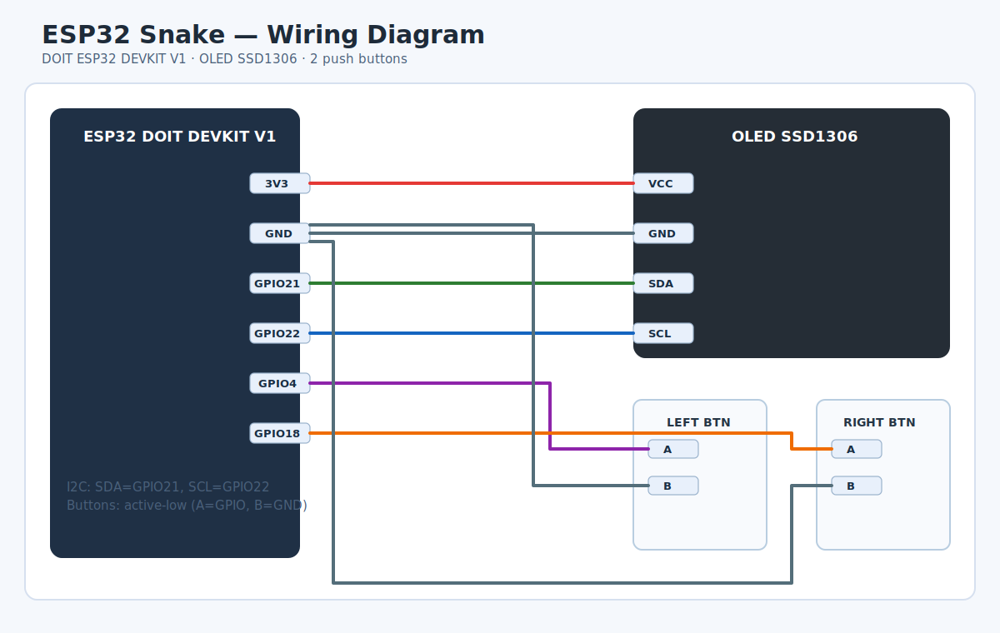

# ESP32 Snake Game

A classic arcade Snake game for ESP32 with OLED SSD1306 display, two control buttons, screen animations, high score storage, and modular architecture on PlatformIO.

## Game Description

**Snake** is a classic arcade game implemented for the ESP32 microcontroller with an OLED display. The player controls a snake that moves across the game field, eats food to grow, and avoids collisions with walls, obstacles, or its own tail. The goal is to achieve the highest possible score.

### Key Features
- **Game field**: 32x8 cells (128x64 pixels display).
- **Snake**: Moves in four directions (up, down, left, right).
- **Food**: Appears randomly on the field, blinks for visual effect.
- **Obstacles**: Random obstacles on the field for increased difficulty.
- **High Score**: Stored in ESP32 non-volatile memory.
- **Game States**:
  - **SPLASH**: Initial screen with title animation and high score.
  - **PLAYING**: Main game.
  - **COLLISION**: Collision animation (snake blink).
  - **GAME_OVER**: Game over screen with final score.
- **Controls**:
  - Left button (GPIO 4): Turn snake left.
  - Right button (GPIO 18): Turn snake right.
  - Start game: Press any button on splash and release.
  - Reset high score: Hold both buttons for 2 seconds on splash.
  - After death: Press button on Game Over screen to return to splash.
- **Visual Effects**:
  - Splash animation.
  - Blinking food.
  - Blinking snake on collision.
  - Centered elements on screen.

### How to Play
1. After ESP32 startup, the splash screen appears with "SNAKE" animation and current high score.
2. Press any button and release to start the game.
3. Control the snake: left button turns left, right button turns right.
4. Snake moves forward automatically; eat food (white squares) to grow.
5. Avoid walls, obstacles, and your own tail.
6. On collision, the game enters COLLISION state with blinking, then GAME_OVER.
7. On GAME_OVER press button to return to splash.
8. To reset the high score on splash, hold both buttons for 2 seconds – the game starts immediately after reset.

### Technical Details
- **Platform**: ESP32 (DOIT ESP32 DEVKIT V1).
- **Display**: SSD1306 OLED 128x64 pixels (I2C).
- **Libraries**:
  - Adafruit GFX and SSD1306 for graphics.
  - ezButton for button handling.
  - Preferences for data storage.
- **Speed**: Snake moves at 300 ms intervals (varies by level).
- **Memory**: High score stored in ESP32 NVS.

## Project Setup

### Deployment
1. Install VS Code.
2. Install PlatformIO IDE extension.
3. Clone the repository:
  ```bash
  git clone https://github.com/Matvik/esp_32_snake.git
  ```
4. Open the project folder in VS Code.
5. Wait for PlatformIO to pull dependencies from `platformio.ini`.
6. Connect ESP32 via USB.
7. To build, run:
  ```bash
  pio run
  ```
8. To upload, run:
  ```bash
  pio run --target upload
  ```
9. To open serial monitor, run:
  ```bash
  pio device monitor -b 115200
  ```

## Hardware Assembly

### Required Components
- 1 x ESP32 DOIT DEVKIT V1
- 1 x OLED display SSD1306 128x64 I2C
- 2 x push buttons without locking
- 1 x breadboard or prototype board
- Jumper wires
- USB cable for ESP32

### Wiring Diagram



Original vector diagram: `assets/esp32-snake-wiring.svg`.

#### OLED SSD1306 over I2C
Standard I2C connection for ESP32:

| OLED | ESP32 |
|---|---|
| VCC | 3.3V |
| GND | GND |
| SDA | GPIO 21 |
| SCL | GPIO 22 |

#### Control Buttons
The code uses the following GPIO pins:
- left button: `GPIO 4`
- right button: `GPIO 18`

Recommended button wiring:
- one button contact to corresponding GPIO
- other button contact to `GND`
- button logic is active-low, so pressed button reads as `LOW`

If your button module doesn''t have built-in pull-up resistors, add external pull-ups to `3.3V` or adapt the circuit for your board.

### Assembly Tips
- Do not apply `5V` directly to ESP32 GPIO
- OLED over I2C should be powered from `3.3V` if not advertised as 5V-safe
- Ensure a common ground for ESP32, display, and buttons
- Keep button wires short to minimize spurious triggers

### Post-Assembly Verification
1. Connect ESP32 via USB.
2. Upload firmware with `pio run --target upload`.
3. If screen doesn''t light up, verify display address `0x3C` and SDA/SCL lines.
4. If buttons behave oddly or unreliably, check pull-up circuit and GND contact.

## Code Structure

The project is built on Arduino Framework using PlatformIO. Code is modular, split across files for better organization.

### Overall Architecture
- **SnakeGame class**: Main class containing all game logic.
- **State machine**: Game operates in four states, switching controlled by `run()` method.
- **Modules**:
  - `Game.cpp`: State handling and input.
  - `GameLogic.cpp`: Game mechanics (movement, food, reset).
  - `GameRender.cpp`: Screen drawing.

### Project Files

#### platformio.ini
PlatformIO configuration file.
- Defines ESP32 board.
- Configures dependencies: Adafruit SSD1306, ezButton, Preferences.
- Build and upload commands.

#### include/Game.h
SnakeGame class header.
- **Constants**:
  - `SCREEN_WIDTH = 128`, `SCREEN_HEIGHT = 64`: Display size.
  - `CELL_SIZE = 4`: Cell size in pixels.
  - `GRID_WIDTH = 32`, `GRID_HEIGHT = 14`: Field size in cells.
  - `BUTTON_LEFT_PIN = 4`, `BUTTON_RIGHT_PIN = 18`: Button pins.
  - `LONG_PRESS_DURATION_MS = 2000`: Duration for long press (high score reset).
  - `COLLISION_BLINK_DURATION_MS = 2000`: Duration of collision screen.
- **Structures**:
  - `Point`: Coordinates (x, y).
- **Enumerations**:
  - `GameState`: SPLASH, PLAYING, COLLISION, GAME_OVER.
- **State Variables**:
  - `snake[200]`: Array of snake points.
  - `food`: Food coordinates.
  - `obstacles[MAX_OBSTACLES]`: Obstacles.
  - `snakeLength`, `dir`: Snake length and direction.
  - `highScore`: High score.
  - `gameState`: Current state.
  - Flags: `foodOn`, `showReleaseMessage`, `wasLongPress`, etc.
- **Methods**:
  - Public: `SnakeGame()`, `begin()`, `run()`.
  - Private: Logic and rendering methods.

#### src/main.cpp
Arduino entry point.
- Creates `SnakeGame` instance.
- Calls `begin()` in `setup()`.
- Calls `run()` in `loop()`.

#### src/Game.cpp
Main state and input logic.
- **Constructor**: Initializes variables, configures buttons.
- **begin()**: Initializes display, loads high score.
- **updateInput()**: Updates button states each loop tick.
- **run()**: Main loop, switches by state.
  - **SPLASH**:
    - Draws splash.
    - Handles input: release starts game, both buttons held resets high score.
    - Shows "Release to start" and "Hold both for reset" messages.
  - **PLAYING**:
    - Handles turns (one per step only).
    - Moves snake every `moveDelay` ms.
    - Checks collisions.
  - **COLLISION**:
    - Draws blinking snake.
    - Transitions to GAME_OVER after duration, saves high score.
  - **GAME_OVER**:
    - Draws game over screen.
    - On button press transitions to SPLASH.
- **Input Methods**: Uses `isPressed()` for events (turns), `getState()` for states (splash).

#### src/GameLogic.cpp
Game mechanics.
- **spawnFood()**: Generates food at random location not on snake or obstacles.
- **resetGame()**: Resets snake, direction, speed, and randomly places obstacles.
- **turnLeft() / turnRight()**: Changes direction if not just turned.
- **moveSnake()**: Moves head, checks food/collisions, updates tail.

#### src/GameRender.cpp
Screen rendering.
- **drawSplash()**: Title animation and high score, or messages depending on `showReleaseMessage`.
- **drawGame()**: Draws field, snake, food (blinks), obstacles, score.
- **drawCollision()**: Alternates between game frame and blank screen for blink effect.
- **drawGameOver()**: Animated "Game Over" screen with current score.

### Key Mechanisms
- **Input handling**: ezButton with debounce. `isPressed()` for one-time events, `getState()` for held state.
- **Timing**: `millis()` for movements, blinking, animations.
- **Storage**: Preferences for high score.
- **Randomness**: `randomSeed(micros())` for food and obstacles.
- **Modularity**: Code split for easy maintenance.

### Build and Run
1. Install PlatformIO.
2. Open project in VS Code with PlatformIO.
3. Connect ESP32.
4. Run `pio run --target upload`.
5. Game starts automatically.

---

## Українська версія

Повна документація також доступна [українською мовою](README.uk.md).
